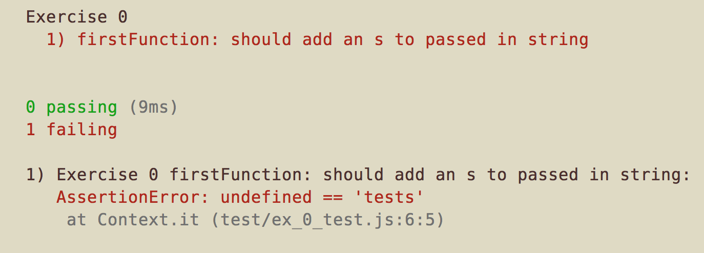
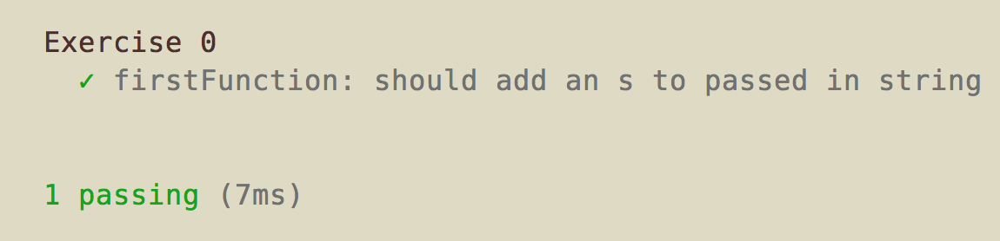

## JS Practice Exercises

Each exercise involves writing the contents to some functions and then running the associated test suite. This is going to involve a few things we haven't done yet in order to get up and running. You'll need to have Node installed (which is in the 301 prework) to run the tests.

### Set Up

1. Clone this repo
2. cd into the directory
3. Run `npm install` (you may need sudo) which will add the functionality you need to run the tests.


### Workflow
1. Open the exercise file in your text editor.
2. Fill in a function. You can copy your code into the browser console to try it out. Or you can run the file with node by typing `node <filename>` in the terminal.
3. In your terminal run the tests with `npm test`. Use `npm test` to run all of them and `npm test <path to test>` to run just one file.

### The Exercises

Each file will contain a series of functions that are all assigned as properties to the `exports` object. `exports` is a Node thing you don't need to know about yet. For now just understand that that's how our test suite is getting ahold of the functions so it can call them.

You'll see something like this:
```javascript
//write a function that returns the passed in string with an s added
//eg 'bat' -> 'bats'
//eg 'bats' ->  'batss'

function firstFunction(string) {
  //your code here
}

exports.firstFunction = firstFunction;
```

The examples take the form of:
`<input> -> <output>`

The input is what gets passed into the function and the output is what the test expects to see (what the function returns.) If you fill it in right, you'll get a passing test!

So, for example:

First run `npm test test/ex_0_test.js`

You should see something like this:


We put in the proper code:
```javascript
//write a function that returns the passed in string with an s added
//eg 'bat' -> 'bats'
//eg 'bats' ->  'batss'

function firstFunction(string) {
  //your code here
  return string + 's';
}

exports.firstFunction = firstFunction;
```

now when we run `npm test test/ex_0_test.js`



There will be a lot more than just one test running. So you'll see a lot of fails an one success when you actually punch this in. That's ok! Just plug away one by one!

### Protips!

- If you console.log anything in your files the console readout will be mixed in with the test readout.

- If you want to run just one test file you can use `npm test <path to the test>`. So if you wanted to run just the tests for exercise two it would be something like `npm test test/ex_2_test.js`.

- Some of these are trickier than others. If you get hung up on one maybe try the next.
